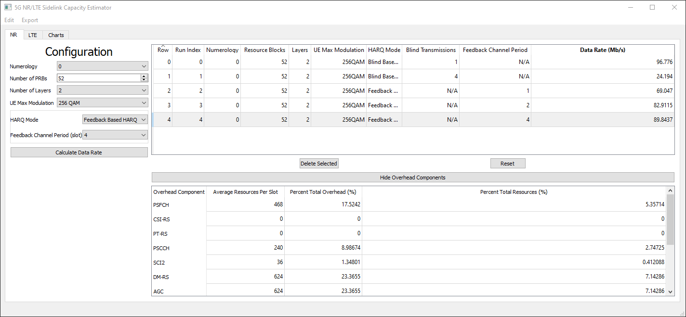
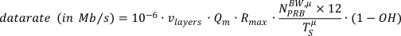
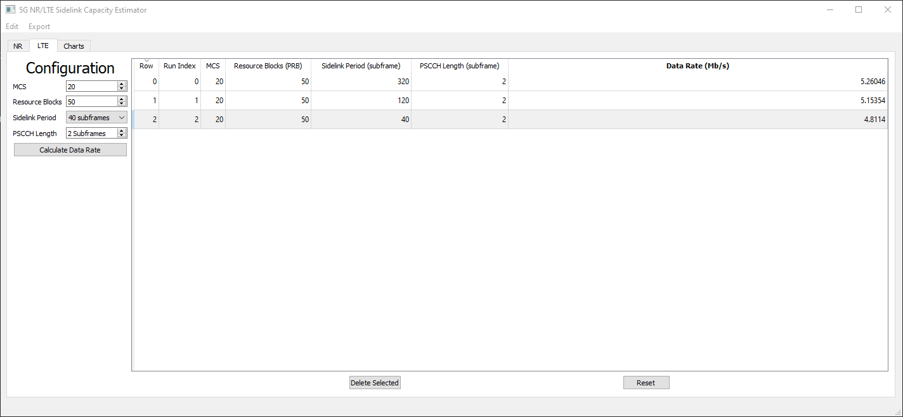
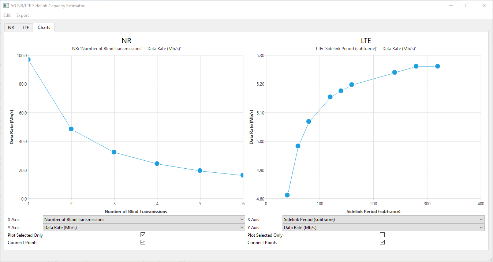

# Introduction
This tool computes the expected link capacity in data rate (Mbit/s) for Sidelink considering 5G New Radio (NR) and Long Term Evolution (LTE) communication standards, as defined by the The 3rd Generation Partnership Project (3GPP). Users can input the respective configuration parameters and evaluate the resulting capacity.

The tool provides side-by-side chart plotting between NR and LTE Sidelink capacities for easy comparison. Data and generated charts can be exported to be used outside the tool.

In the current release, the tool applies to the public safety band, Band 14/n14 (the 700 MHz frequency band).

## New Radio (NR) Sidelink Capacity


For unicast and under different NR sidelink configurations at the public safety band (Band n14), the NR Sidelink capacity estimator calculates the maximum achievable data rate in (Mb/s), together with the associated overhead components. 

The configurations include:

- Numerology. Per the 3rd Generation Partnership Project (3GPP), for Band n14 10 MHz, the valid values are 0 and 1.
- Number of PRBs (Physical Resource Blocks). Per 3GPP, for Band n14 10 MHz, the maximum number of PRBs are 52 and 24 for *&mu;* = 0 and 1, respectively. The allocated number of PRBs is no larger than the maximum number of PRBs.
- Number of Layers. Per 3GPP, for NR sidelink, the number of layers can be 1 or 2.
- UE (User Equipment) Max Modulation. Per 3GPP, depending on the UE's capability, UE's max modulation can be 64QAM or 256QAM.
- HARQ (Hybrid Automatic Repeat reQuest) Mode.
  - Feedback-Based HARQ. To achieve the maximum data rate, ideal channel and no retransmission is assumed.
    - Feedback Channel Period (slot). Per 3GPP, the valid values are 0, 1, 2, and 4.
  - Blind-Based HARQ.
    - Number of Blind Transmissions. Per 3GPP, the valid values are 1, 2, ..., and 32.

The capacity is calculated per equation:



where *v<sub>layers</sub>* is the spatial multiplexing number of layers, *Q<sub>m</sub>* is the modulation order, which can be 6 (64QAM) or 8 (256QAM), *R<sub>max</sub>* is the maximum achievable coding rate, which is 948/1024, *&mu;* is the numerology, *N<sub>PRB</sub>* is the number of allocated PRBs, *T<sub>S</sub><sup>&mu;</sup>* is the symbol duration time in seconds for numerology *&mu;*, which is 1/14 x 10<sup>-3</sup> for *&mu;* = 0 and 1/28 x 10<sup>-3</sup> for *&mu;* = 1, and *OH* is the overhead ratio, which is the resource elements (REs) occupied by the overhead components over the total number of available REs for transmission.  

The overhead components calculated include: 

- Physical Sidelink Feedback Channel (PSFCH), if feedback-based HARQ is enabled,
- Channel State Information Reference Signal (CSI-RS),
- Phase-Tracking Reference Signal (PT-RS),
- Physical Sidelink Control Channel (PSCCH),
- Second-stage Control Information (SCI2) in Physical Sidelink Shared Channel (PSSCH),
- Demodulation Reference Signal (DM-RS),
- Automatic Gain Control (AGC),
- Guard,
- Sidelink Synchronization Signal Block, (S-SSB), and
- Redundant data, if blind-based HARQ is enabled.

For computation of multiple configurations, the above items can be displayed by clicking on the corresponding configuration. Each selected configuration can be deleted by depressing the "Delete Selected" button, and all the configurations can be reset to default using the "Reset" button. 

It is also important to note that as subchannel is not critical in our NR sidelink capacity investigation, this software assumes that one subchannel is used, and all of the *N<sub>PRB* are allocated to this single subchannel. Besides, we assume minimum number of S-SSBs is configured, which is one in each 160 ms, and within a sidelink configuration period of 10240 ms, all the rest slots are used as sidelink slots.

## Long Term Evolution (LTE) Sidelink Capacity


The LTE Sidelink capacity is dictated by:
- The duration of the Sidelink period (supported values are defined in 3GPP TS36.331).
- The duration of the physical Sidelink channels within the period, i.e., Physical Sidelink Control Channel (PSCCH) and Physical Sidelink Shared Channel (PSSCH). The PSCCH time length can be set from 2 Subframes to a maximum of 40 Subframes (as defined in 3GPP TS36.213). In LTE 1 Subframe is equal to 1 millisecond. The PSSCH time length is set to occupy the remaining period duration after the preceding PSCCH. Since the objective of this tools is to determine the maximum capacity in data rate, time offset and subframe masking is not considered.
- The selected Modulation and Coding Scheme (MCS) and number or Resource Blocks for data transmission.

## Chart Plotting


# Installation Instructions

## Requirements

* Python 3.6+

## Create a virtual environment

```shell
python -m venv venv
source venv/bin/activate
```

## Install Dependencies

```shell
pip install -r requirements.txt
```

## Run

```shell
python main.py
```

# Development
Follow the [Installation](#installation) instructions above

## Compiling UI Files

### The Quick Way
There's a convenience script to run the following commands,
be sure virtual environment is activated.
```shell
./compile_ui.sh
```

### Manual

If the UI is updated, then the UI files need to be recompiled, run the
following in the virtual environment

```shell
pyside2-uic main-window.ui > ui_mainwindow.py
pyside2-uic csv_dialog.ui > ui_csvdialog.py
```
