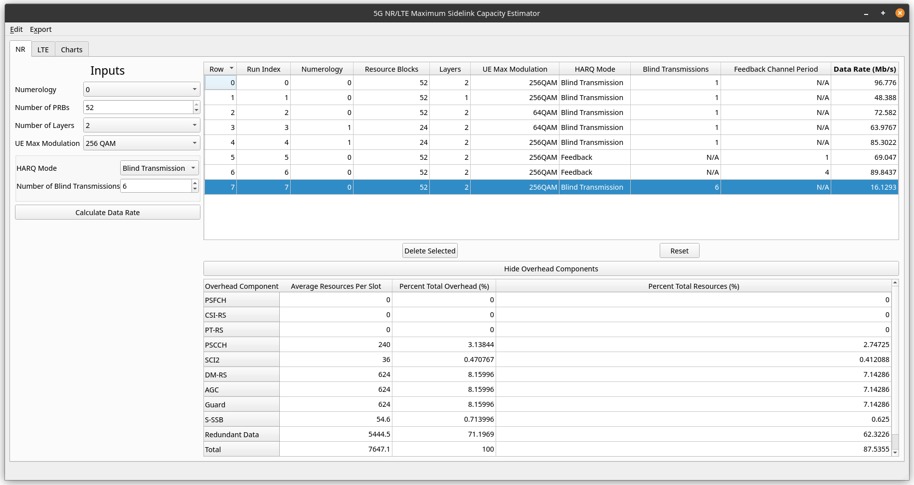

# Introduction

This is the prototype for the Sidelink Capacity Tool



# Installation

## Requirements

* Python 3.6+
* Qt 5.9+ (charts, core, widgets)

## Create a virtual environment

```shell
python -m venv venv
source venv/bin/activate
```

## Install Dependencies

```shell
pip install -r requirements.txt
```

## Run

```shell
python main.py
```

# Development
Follow the [Installation](#installation) instructions above

## Compiling UI Files
If the UI is updated, then the UI files need to be recompiled, run the
following in the virtual environment

```shell
pyside2-uic main-window.ui > ui_mainwindow.py
pyside2-uic csv_dialog.ui > ui_csvdialog.py
```

The UI compiler makes a slight mistake with an import in the generated file,
correct it with the shell command below

```shell
sed -i 's/from PySide2.QtCharts import QtCharts.QChartView/from PySide2.QtCharts import QtCharts/g' ui_mainwindow.py
```
