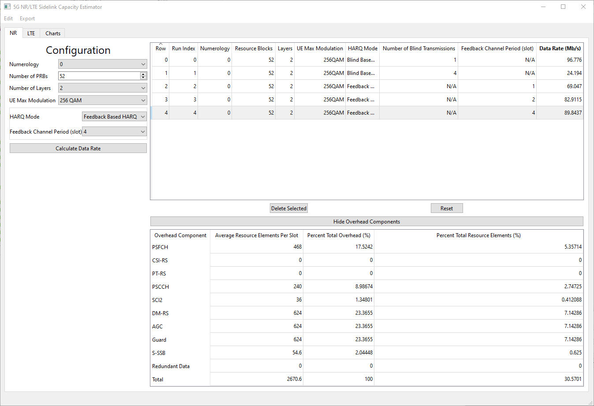
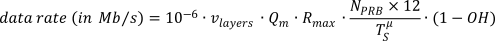

# Introduction
This tool computes the expected link capacity in data rate (Mbit/s) for Sidelink considering 5G New Radio (NR) and Long Term Evolution (LTE) communication standards, as defined by the The 3rd Generation Partnership Project (3GPP). Users can input the respective configuration parameter and evaluate the resulting capacity.

The tool provides side-by-side chart plotting between NR and LTE Sidelink capacities for easy comparison. Data and generated charts can be exported to be used outside the tool.

## New Radio (NR) Sidelink Capacity


The NR Sidelink capacity calculates the maximum achievable data rate in (Mb/s) at the public safety band (n14), following the equation

where v<sub>layers</sub>

## Long Term Evolution (LTE) Sidelink Capacity


The LTE Sidelink capacity is dictated by:
- The duration of the Sidelink period (supported values are defined in 3GPP TS36.331).
- The duration of the physical Sidelink channels within the period, i.e., Physical Sidelink Control Channel (PSCCH) and Physical Sidelink Shared Channel (PSSCH). The PSCCH time length can be set from 2 Subframes to a maximum of 40 Subframes (as defined in 3GPP TS36.213). In LTE 1 Subframe is equal to 1 millisecond. The PSSCH time length is set to occupy the remaining period duration after the preceding PSCCH. Since the objective of this tools is to determine the maximum capacity in data rate, time offset and subframe masking is not considered.
- The selected Modulation and Coding Scheme (MCS) and number or Resource Blocks for data transmission.

## Chart Plotting


# Installation Instructions

## Requirements

* Python 3.6+

## Create a virtual environment

```shell
python -m venv venv
source venv/bin/activate
```

## Install Dependencies

```shell
pip install -r requirements.txt
```

## Run

```shell
python main.py
```

# Development
Follow the [Installation](#installation) instructions above

## Compiling UI Files

### The Quick Way
There's a convenience script to run the following commands,
be sure virtual environment is activated.
```shell
./compile_ui.sh
```

### Manual

If the UI is updated, then the UI files need to be recompiled, run the
following in the virtual environment

```shell
pyside2-uic main-window.ui > ui_mainwindow.py
pyside2-uic csv_dialog.ui > ui_csvdialog.py
```
