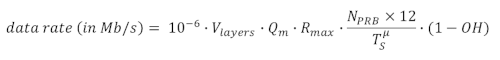
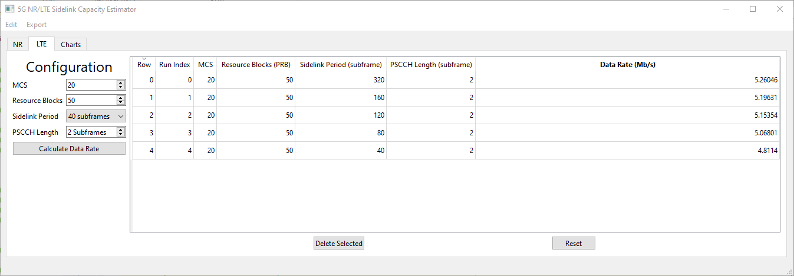

# Introduction
This tool computes the expected link capacity in data rate (Mbit/s) for sidelink considering 5G New Radio (NR) and Long Term Evolution (LTE) communication standards, as defined by The 3rd Generation Partnership Project (3GPP). Users can input the respective configuration parameters and evaluate the resulting capacity.

The tool provides side-by-side chart plotting between NR and LTE sidelink capacities for easy comparison. Data and generated charts can be exported to be used outside the tool.

In the current release, the tool applies to 10 MHz bands plus numerology 0 and 1 in case of 5G NR.  One example is the public safety band, Band 14/n14 (the 700 MHz frequency band).

# Installation Instructions

## Supported Platforms
* Windows 10/11
* macOS 12 Monterey (Intel & Apple M1)
* Most Linux Distros

## Requirements

* Python 3.6+

## Create a virtual environment
Some users may need to replace `python` below
with `python3`

```shell
python -m venv venv
source venv/bin/activate
```

## Install Dependencies

```shell
pip install -r requirements.txt
```

## Run

```shell
python main.py
```

## New Radio Sidelink Capacity


For unicast and under different NR sidelink configurations, the NR Sidelink Capacity Estimator calculates the maximum achievable data rate in (Mb/s), together with the associated overhead components. 

The parameters to be configured are listed as below.  The ranges of the parameters are set per 3GPP specifications.

- Numerology. The valid values of the current release is 0 and 1.
- Number of PRBs (Physical Resource Blocks). Per 3GPP, for 10 MHz bands, the maximum number of PRBs are 52 and 24 for *&mu;* = 0 and 1, respectively. The allocated number of PRBs is no larger than the maximum number of PRBs.
- Number of Layers. Per 3GPP, for NR sidelink, the number of layers can be 1 or 2.
- UE (User Equipment) Max Modulation. Per 3GPP, depending on the UE's capability, UE's max modulation can be 64QAM or 256QAM.
- HARQ (Hybrid Automatic Repeat reQuest) Mode.
  - Feedback-Based HARQ. To achieve the maximum data rate, ideal channel and no retransmission are assumed.
    - Feedback Channel Period (slot). Per 3GPP, the valid values are 0, 1, 2, and 4.
  - Blind-Based HARQ.
    - Number of Blind Transmissions. Per 3GPP, the valid values are 1, 2, ..., and 32.

The capacity is calculated per equation:



The variables in the equation map to the parameters configured above, as below. *v<sub>layers</sub>* is the spatial multiplexing number of layers, *Q<sub>m</sub>* is the modulation order, which can be 6 (64QAM) or 8 (256QAM), *R<sub>max</sub>* is the maximum achievable coding rate, which is 948/1024, *&mu;* is the numerology, *N<sub>PRB</sub>* is the number of allocated PRBs, *T<sub>S</sub><sup>&mu;</sup>* is the symbol duration time in seconds for numerology *&mu;*, which is 1/14 x 10<sup>-3</sup> for *&mu;* = 0 and 1/28 x 10<sup>-3</sup> for *&mu;* = 1, and *OH* is the overhead ratio, which is ratio of the resource elements (REs) occupied by the overhead components over the total number of available REs for transmission. Here the overhead components include REs occupied by redundant data due to HARQ retransmissions.  

The overhead components calculated include: 

- Physical Sidelink Feedback Channel (PSFCH), if feedback-based HARQ is enabled,
- Channel State Information Reference Signal (CSI-RS),
- Phase-Tracking Reference Signal (PT-RS),
- Physical Sidelink Control Channel (PSCCH),
- Second-stage Control Information (SCI2) in Physical Sidelink Shared Channel (PSSCH),
- Demodulation Reference Signal (DM-RS),
- Automatic Gain Control (AGC),
- Guard symbol,
- Sidelink Synchronization Signal Block (S-SSB), and
- Redundant data, if blind-based HARQ is enabled.

For computation of multiple configurations, the capacity and overhead components can be displayed by clicking under the corresponding configuration. Each selected configuration can be deleted by pressing the "Delete Selected" button, and all the configurations can be reset to default using the "Reset" button. 

It is also important to note that as subchannel is not critical in our NR sidelink capacity investigation, this tool assumes that one subchannel is used, and all of the *N<sub>PRB* are allocated to this single subchannel. Besides, we assume minimum number of S-SSBs is configured, which is one in each 160 ms, and within a sidelink configuration period of 10240 ms, all the rest slots are used as sidelink slots.

## LTE Sidelink Capacity


LTE sidelink transmissions occur in a periodic manner. Physical channels for the transmission of control information and data are defined as Physical Sidelink Control Channel (PSCCH) and Physical Sidelink Shared Channel (PSSCH), respectively. PSCCH and PSSCH transmissions are multiplexed in time within the sidelink period, where the transmission of the PSCCH always precedes the PSSCH.

The LTE sidelink data rate capacity is dictated by:
- The duration of the sidelink period (supported values are defined in 3GPP TS36.331).
- The duration of the physical sidelink channels within the period, i.e., PSCCH and PSSCH.
  - The PSCCH time length can be set from 2 Subframes to a maximum of 40 Subframes (as defined in 3GPP TS36.213). In LTE, 1 Subframe is equal to 1 millisecond.
  - The PSSCH time length is set to occupy the remaining period duration after the preceding PSCCH. Since the objective of this tools is to determine the maximum capacity in data rate, time offset and subframe masking is not considered.
- The selected Modulation and Coding Scheme (MCS) and number or PRBs for data transmission.

For example, let's assume a sidelink period lasting 40 Subframes (0.040 s), 2 Subframes are reserved for the PSCCH, leaving 38 Subframes available for the transmission of PSSCH. Blind-Based HARQ with 4 fixed transmissions, for every Transport Block (TB), is used in the PSSCH. Hence, the resulting number of TBs containing new information per sidelink period is 9 (38/4). The TB size (TBS) in bits is determined from the number of PRBs dedicated to the PSSCH and the selected MCS. Sidelink procedures for TBS determination are specified in 3GPP TS36.213, where a set of TBS lookup tables are provided. Let's assume the PSSCH is configured with 50 PRBs and MCS 20 is used, this results in a TBS of 21384 bits. The resulting data rate is 4.8114 Mb/s, computed from:


<!--- data rate (in Mbit/s) = 10e-6 * TBS * TB_per_period / Period length (in seconds)"
--->


## Chart Plotting


All the results calculated in the NR and LTE tabs may be visualized in the Charts tab.

In the Charts tab, there are two charts, one on the left for NR results, and one on
the right for LTE results.

Beneath each chart are dropdowns for the X and Y axes of each chart. These values
correspond to the inputs/table columns in the NR and LTE tabs. Changing these values
changes which portion of the result is plotted on the graph.

The "Plot Selected Only" limits the plot above to only the rows selected on
the result table in the section corresponding to the plot. To select multiple
rows, hold down the control key (cmd on macOS) and click several rows, or
click one row, hold the shift key, and click another row to select a range
of rows.

The "Connect Points" checkbox determines if lines should be drawn
between the points on the graph.

Each chart may be exported as an image by right-clicking on the chart
and selecting "Save As Image" to save an image of the chart as a file
or "Copy to Clipboard" to export the chart to the clipboard for pasting.

The values in each chart are always plotted in the order they appear
in their corresponding result table.

While the Charts tab provides a convenient way for users to visualize the results, users could export the data outside of the tool for further processing and chart generation.

## Command Line Interface
In addition to the graphical user interface, there is the option to
pass in the values for each input, and have the estimated data rate
printed out.

Unlike the graphical interface, the command line interface
has no extra dependencies, and likely does not require
the use of a virtual environment.

### Options
Numbers in square brackets `[1-10]` represent an inclusive range,
values in curly brackets `{Blind, Feedback}` represent a list
of possible options.

#### Standard Options
Pass `--cli` to use the command line interface mode,
then either `--lte` or `--nr` to select the technology
to perform the calculation for

```
  -h, --help            show this help message and exit
  -c, --cli             Run the program in CLI mode
  -g, --gui             Run the program showing the GUI. Ignores all other arguments
  -n, --nr              Perform the calculation for NR
  -l, --lte             Perform the calculation for LTE
```

#### NR Options
If `--nr` is passed, then all the following are required
```
  --resource-blocks [1-110]
  --numerology {0,1}
  --layers {1,2}
  --ue-max-modulation {64,256}
  --harq-mode {Blind, Feedback}
  --blind-transmissions [1-32]
  --feedback-channel-period {1,2,4}
```

#### LTE Options
If `--lte` is passed, then all the following are required
```
  --resource-blocks [1-110]
  --mcs [0-20]          Modulation and Coding scheme
  --sidelink-period-size {40,60,70,80,120,140,160,240,280,320}
  --pscch-length [2-`sidelink-period-size`]
                        Physical side link control channel length in subframes
```

### LTE Example
```shell
python ./main.py --cli --lte --resource-blocks 50 --mcs 20 --sidelink-period-size 40 --pscch-length 2
Data rate: 4.8114 Mb/s
```

### NR Example
```shell
python ./main.py --cli --nr --resource-blocks 52 --numerology 0 --layers 2 --ue-max-modulation 256 --harq-mode "Blind" --blind-transmissions 1
Data rate: 96.77598749999999 Mb/s
```

# Testing

To run the automated tests, run `test.py` with
the virtual environment activated


```shell
python test.py
```

The current tests cover the `core.py` module,
but not the command line/graphical interfaces.

The application has been manually and
automatically tested on Windows 10,
macOS 12 Monterey, and Arch Linux.

# Contributing
Follow the [Installation](#installation-instructions) instructions above.

## Compiling UI Files
Most UI elements were created using the Qt Designer. If these files
are changed, then the UI files must be re-compiled.

### Script
There's a convenience script to run the following commands.
Be sure the virtual environment is activated.
```shell
./compile_ui.sh
```

### Manual
Run the following commands with the virtual environment activated

```shell
pyside6-uic main-window.ui > ui_mainwindow.py
pyside6-uic csv_dialog.ui > ui_csvdialog.py
```

# License
Some portions of this project are licensed under a different license than
the one in [LICENSE.md](LICENSE.md). Please see [THIRD_PARTY_LICENSES.md](THIRD_PARTY_LICENSES)
for their specific licences.
